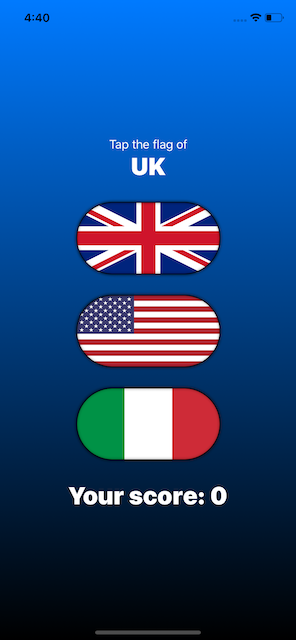

# GuessTheFlag
This project is a guessing game that helps users learn some of the many flags of the world

## Using stacks to arrange views
- three particularly useful view types are **HStack**, **VStack** and **ZStack**
- they handle stacking views horizontally, vertically and in depth respectively
- the body property can only return exactly one view, to stack multiple views the above views are used
- to add spacing between the stacked views the __spacing__ parameter of the stacking view is used
- to align the stacked views, the __alignment__ property of the stacking view can be used
- both __HStack__ and __VStack__ automatically fill their content and try to align themselves to the center
- **Spacer()** views can be used to push contents of stacks to one side, they automatically take up all the remaining space
- adding more than one spacer will divide the remaining space between them
- to overlap views, a __ZStack__ is used, they don't provide spacing but do offer alignment

## Colors and frames
- using a the **.background** modifier to apply a color will fill the background of the view
- if applied to a stack, it will only fill the space that is actually used instead of the whole screen
- to apply a background color to the whole screen a __ZStack__ can be used with a **Color** view as it's first subview
- a __Color__ view automatically takes up all the available space
- the **frame()** modifier can be used to give a view a specific size
- aside from normal colors SwiftUIs __Color__ views also offer semantic colors
- **Color.primary** is the default color of text in SwiftUI and will be either black or white, depending on the devices light/dark mode
- **Color.secondary** is also black or white depending on the devices light/dark mode but has slight transparency
- for even more specific colors it's possible to pass __red__, __green__ and __blue__ parameters to the view, which values between 0 and 1
- even when a __Color__ view takes up the full screen it'll leave some white space, the safe area
- if some content should go under the safe area, the **.edgesIgnoringSafeArea()** modifier can be used
- this should be used sparely and if possible only for decorative things

## Gradients
- SwiftUI offers 3 kinds of gradients, all of which are made up of
  - an array of colors to show
  - size and direction information
  - the type of gradient to use
- **LinearGradient** goes in one direction, so it needs a start and end point
- **RadialGradient** goes outward in a circle shape, so it needs a start and end radius
- **AngularGradient** cycles colors around in a circle rather than radiating outward
- they all can be used as stand alone views, part of a modifier or a background for a view

## Buttons and images
- can be made in two ways
  - with a title and trailing closure of code that is executed on tapping it
  - with the closure first and then any kind of view inside the button view
- the **Image** type can be used in three main ways
  - `Image("pencil")` loads the image called 'pencil' that was added to the project
  - `Image(decorative: "pencil")` will load the same image, but won't read it for users with a screen reader
  - `Image(systemName: "pencil")` will load the icon that is built into iOS, using Apple's SF Symbols icon collection
- using the second way to create a button it is possible to create buttons with custom images
- if an image becomes filled with a color, e.g. solid blue, that likely is SwiftUI trying to show they're tappable
- to show the original image the **renderingMode(.original)** modifier can be used

## 
