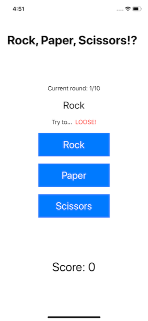

# 100 Days of Swift - Day 25 - Consolidation II
Consolidation/Review of Days 16 to 24, notes in this readme, challenge completed in the project

## What I learned
- building scrollable forms that mix text with controls like __Picker__
- creating a __NavigationView__ with a title to avoid content going under the safe area
- storing changing data using __@State__
- creating two-way bindingds for UI controls
- using __ForEach__ to create multiple views with a loop
- building complex layouts using __VStack__, __HStack__ and __ZStack__
- using colors and gradients and giving views specific frames
- creating custom buttons with text or images and a closure to be executed on tap
- creating alerts and defining the conditions they should show under
- how to use the ternary operator for conditional modifiers
- breaking code into small parts, using view composition and custom modifiers
- how important protocols are, e.g. the __View__ protocol

## Key points
### Structs vs classes
- classes don't come with a memberwise initializer, structs get these by default
- classes can inherit from a parent class, structs cannot
- a copy of a class and the original point to the same data, copies of structs are unique
- classes can have deinitializers, structs cannot
- variable properties in constant classes can be changed, properties in constant structs cannot be changed

### Working with ForEach
- __ForEach__ is a view that allows for creation of other views inside a loop
- this also allows for bypassing the ten-child limit that SwiftUI has
- it's possible to use either a range like `ForEach(0 ..< array.count)` or loop over the array directly using `ForEach(array, id: \.self)`
- the later uses the array values themselves to identify each element uniquely
- there is a third way of identifying views, using the `Identifiable` protocol

## Working with bindings
- for most views a one-way or two-way binding is enough, creating a __@State__ property and using it inside them, if needed with **$** for a two-way binding
- sometimes it's useful to be able to react to a change in a binding, this can be accomplished with custom bindings
- __custom bindings__ can be used just like regular bindings, but offer more control over how they work
- to use them a property of the type `Binding<Type>` is created, where the type inside the `< >` is the underlying type
- `get: {...}` and `set: {...}` are used to read and write values to the binding
- custom bindings also don't need the **$** sign for a two-way binding

## Challenge
- create an app that challenges the player to win art rock, paper, scissors
  - each turn the app randomly picks either rock, paper or scissors
  - each turn the app prompts the player to either win or loose the game
  - if they're correct, they score a point, otherwise lose a point
  - the game ends after 10 questions and the score is shown
