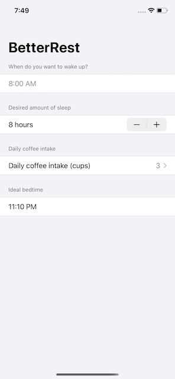

# BetterRest
This project is an app designed to help coffee drinkers get a good night's sleep by using Machine Learning

## Entering numbers with Stepper
- one of the ways SwiftUI lets users enter numbers is by using a **Stepper** view
- the other option would be a __Slider__, which is less precise
- Steppers can adapt to any kind of number they are bound to
- to limit the values of a stepper a range is used `Stepper(value: $var, in: 1...10) {...}`
- another useful parameter for steppers is the step value `Stepper(..., step: 0.25) {...}`

## Selecting dates and times with DatePicker
- SwiftUI offers a dedicated picker type, **DatePicker** that can be bound to a **Date** property
- by default the view provides a spinning wheel with a label to the left
- if used in a __Form__ view it'll change to a single row that folds out when tapped
- alternatively, to not show the label outside of a __Form__ view, the `.labelsHidden()` modifier can be used
- this way it shows the spinning wheel without a label, but the original label will still be read by screenreaders
- using the `displayedComponents` parameter the picker can be further configured to show different components
- as with stepper, there is a `in` parameter that accepts a date range (also accepts one-sided ranges)

## Working with dates
- the **DateComponents** type allows for reading/writing specific parts of a date
- using the `date(from:)` method it's possible to create a __Date__ from __DateComponents__
- this method returns an optional date and should be used with nil coalescing to have a default value
- with the help of `Calendar.current.dateComponents(...)` it's possible to get components from a date value
- the first parameter of this method is an array of the components wanted, the second the date to get those components from
- the returned values are optionals again, so nil coalescing is advised
- to format a date to a string,  an instance of **DateFormatter** can be used
- after creating the instance, the `timeStyle` is set
- finally, using the `string(from:)` on the formatter instance, a string is created from the given date 

## Training a model with Create ML
- in general machine learning happens in two steps, training the model and then asking it for predictions
- training is the process of the computer figuring out the relationship between all the values
- prediction is then done on device, the model will use previous results to make predictions about new data
- to train a model on mac the **Create ML** app is used
- after selecting the right template the model is fed with data, e.g. by importing a `.csv` file under __Training Data__
- next the target value (what should be optimized) and the features (other data that influences the target) need to be selected
- finally, an algorithm needs to be chosen
  - automatic
  - **Linear Regression**, tries to estimate by considering variables as part of a liniar function, e.g. "drawing a straight line' through all data points
  - **Decision Tree**, tries to narrow down, branching like a tree, e.g. the game "20 questions"
  - **Boosted Tree**, a serious of decision trees where each tree is designed to correct errors in the previous tree, has only access to a subset of data
  - **Random Forest**, similiar to boosted trees, but every decision in the tree is made with access to all available data
- after training there will be an output file, the trained model, which can be used in a project
- the **Root Mean Squared Error** shown after training is the average error of the models prediction

## Building a basic layout
- using the `.navigationBarItems` modifer it's possible to add views to the navigation bar, like a **Button** view
- in left-to-right locales the `trailing:` parameter will put the view on the right, the `leading:` parameter on the left
- instead of using a trailing closure on the button view to call a function, it's possible to pass the function as an argument directly
- `Button(action: functionName)`, note that the function argument is not followed by parentheses
- parentheses would mean to call the function directly, but here it is just passed as an argument

## Connecting SwiftUI to Core ML
- to use a trained model in a project, simply dragging it into the project navigator in Xcode is enough
- Xcode will then automatically create a hidden class (only created as part of the build process) with the same name as the model
- to use the model, simply creating an instance of it and calling it's `prediction()` method with the necessary arguments is enough
- since this method can throw errors, it should be wrapped in a __do/catch__ block
- after that the only thing left is to format and present the results

## Cleaning the user interface
- adding a (static) computed property that provides a default wake up time value
- switch __VStack__ to __Form__
- wrap each __Text__ view and control view pair into a VStack and style it, so each pair takes one row instead of two

## Wrap up - Challenges
- replace `VStack` views with `Section` views
- replace 'number of cups' `Stepper` with a `Picker`
- change UI to always show the recommended bedtime, remove 'Calculate button'
