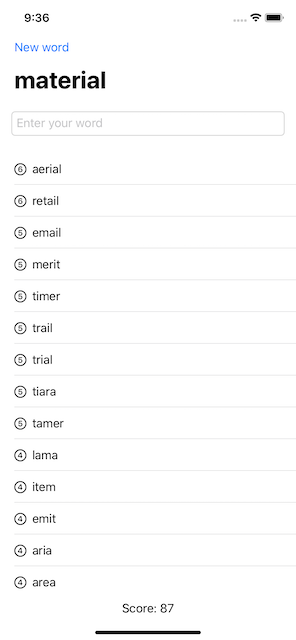

# Word Scramble
A simple wordgame, showing a random word and asking the player to make words from its letters.

## Introducing List
- the **List** view provides a scrolling table of data, similiar to the __Form__ view
- while Form views are mostly used for user input, List views are for presenting data
- List views work with both static views or dynamically created ones and even with both mixed
- a good example of mixed views in a list is the settings app, e.g. the Wi-Fi section
- lists can be styled similiar to forms using the `.listStyle(GroupedListStyle())` modifier
- if a list contains only dynamic views it can be used with a range parameter, e.g. `List(0..<array.count)`
- the `id` parameter is used so that SwiftUI can uniquely identify each row
- for arrays of strings and numbers, their values themselves make them unique, so `id: \.self` can be used
- to mix static views and uniquely identified views in a list, `ForEach` has to be used

## Loading resources from the app bundle
- for **Image** views SwiftUI automatically looks in the app's asset catalog and adjusts the images size for the device
- other data types are usually stored in the apps **Bundle** and accesses via the **URL** data type
- to get the url for a file the `url(forResource:, withExtension:)` method is called on the bundle the file is in
- e.g. `Bundle.main.url(forResource: "some-file", withExtension: "txt")`
- then the content of the file needs to be loaded into a variable of fitting type
- e.g. text into a string variable via the `String(contentsOf:)` initializer

## Working with strings
- `components(seperatedBy:)` converts a single string into an array, broken up by the string provided
- it's also possible to provide a special character sequence, like `\n`
- `randomElement()` returns an optional value of a random element in the array
- it's optional in case the array it was called on was empty
- `trimmingCharacters(in:)` removes certain characters specified in the `in:` argument
- the `in:` parameter expects a value of type **CharacterSet**
- since removing whitespace and new lines is so common, its built right in `str.trimmingCharacters(in: .whitespacesAndNewlines)`
- to check a string for misspelled words the **UITextChecker** class can be used
- additionally an __Objective-C string range__ is needed `let range = NSRange(location: 0, length: str.utf16.count)`
- to check for spelling errors, `rangeOfMisspelledWord(in:, range:, startingAt:, wrap:, language:)` is used
- e.g. `let misspelledRange = checker.rangeOfMisspelledWord(in: str, range: range, startingAt: 0, wrap: false, language: "en")`
- if no spelling errors were found, it will return a special value of `NSNotFound`

## Wrap up - Challenges
- 
