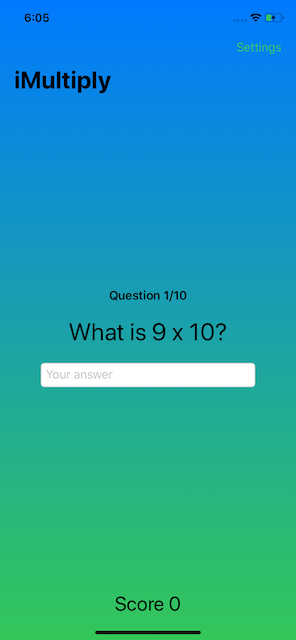
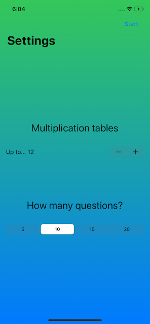

# 100 Days of Swift - Day 35 - Consolidation III
Consolidation/Review of Days 26 to 34, notes in this readme, challenge completed in the project

 

## What I learned
- getting user input via **Stepper** and **DatePicker** and customizing the views
- working with **Date**, **DateComponents** and **DateFormatter**
- how to use machine learning
- using **List**, especially with arrays
- using `onAppear()` for inital setup
- loading files from the app bundle
- checking strings for spelling with **UITextChecker**
- creating implicit, explicit and attached to bindings animations
- customizing animations
- controlling the animation stack
- using `DragGesture()` and SwiftUI's built-in transitions

## Key points
### Ranges with ForEach and List 
Currently, when using ranges in **ForEach** and **List**, it's only possible to use normal ranges like `0..<5`,
using closed ranges like `0...5` is currently not possible in SwiftUI, but might be in the future.
The reason for that is, that both **ForEach** and **List** expect a `Range<Int>`, but `0...5` is a `ClosedRange<Int>`

### What makes a string?
Strings are one of the most complex features, they look easy from the outside, just letters stringed together,
but internally not every letter is a single character. For example emojis are often comprised out of a multiple characters,
like the base thumbs-up emoji is followed by a modifier for skin tone.
This also is the reason why it's **not** possible to use access letters like this `str[0]`
Luckily SwiftUI does most of the heavy lifting when it comes to such strings.

### Flat app bundles
**Asset catalogs** can handle a variety of things, like vectors, colors, textures, pictures and more.
When Xcode builds the project, it goes through the asset catalog and optimizes them for the target devices, 
then puts the results into a so-called compiled asset catalog that can be loaded especially efficient.
**Loose assets** are all other media types in the app, like text files, JSON, XML, movies and more.
It's possible to group them in Xcode, but at build time Xcode will put them all in the same __resource__ directory,
which is why it is not possible to have multiple loose asset files with the same name.

## Challenge
Create an 'edutainment' app that helps practicing multiplication tables
- player needs to select which multiplication tables they want to practice
- player should be able to select how many questions they want to be asked
- questions should be randomly generated, within the difficulty range selected by the player
