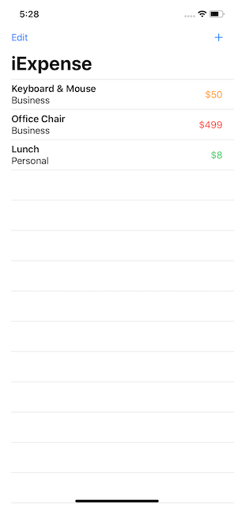

# iExpense 
An expense tracking app that seperates personal costs from business costs




## Why @State only works with structs
- when a property in a **struct** changes, the whole struct changes, causing the SwiftUI to update the UI
- this is not the case for **classes**, so SwiftUI doesn't update the UI when a property in a class changes
- since structs always have unique owners, sending a struct to two views will actually give each view a unique copy
- this means, if one changes, the other won't, which is bad for sharing state
- sending a class to two views will have both of them point to the same data, but won't reflect changes in state
- to share data between views **@ObservedObject** can be used

## Sharing SwiftUI state with @ObservedObject
- to share data between two views a class and either **@ObservedObject** or @EnvironmentObject are needed
- for now, and in this project, the focus will be on @ObservedObject
- to make use of @ObservedObject, the properties that should be watched by SwiftUI need to be marked with **@Published**
- additionally the class needs to conform to the **ObservableObject** protocol
- the state variable in the view then simply uses **@ObservedObject** instead of @State

    ``` swift
    class User: ObservableObject {
        @Published var firstName = "Odd"
        @Published var lastName = "Magnet"    
    }
    struct ContentView: View {
        @ObservedObject var user = User()
        ...
    }
    ```

## Showing and hiding views
- one of the most basic ways of showing a view in SwiftUI are **Sheets**
- they present a new view on top of the existing one in a card-like presentation
- similiar to __Alerts__ they work based on conditions, which determine if they are presented or dismissed
- to show a new view in a sheet, a state variable is needed to track whether or not the sheet is showing, usually that is a boolean
- like alerts a modifier is used to attach the sheet to the view hierachy: `.sheet(isPresented:)`
- lastly, the sheet needs to contain a view to show when it's being presented
- to dismiss a sheet view programmatically (e.g. when user pressed a button), **@Environment** can be used
- it allows for creation of properties that store provided values externally, e.g. light/dark mode, font size, timezone
- to make use of this `@Environment(\.presentationMode) var presentationMode` needs to be added to the view that is displayed in a sheet
- to dismiss the sheet, `self.presentationMode.wrappedValue.dismiss()` is called
- __wrappedValue__ is needed since __presentationMode__ is actually a binding, so it can be updated automatically by the system

## Deleting items using onDelete()
- the `.onDelete()` modifier is used to control how objects are deleted from collections, it is mostly used with **List** and **ForEach**
- attaching `.onDelete()` also enables the user to remove rows from a list for example
- it can only be used on **ForEach**, which means a bit more code, but also makes it easy to create lists where only some rows can be deleted
- to use `.onDelete()` a method needs to be implemented that receives a single parameter of type `IndexSet`, holding the positions of items that should be removed
- if the list was created from a single array, the `remove(atOffsets:)` method of the array can be used
- to allow the user to delete several rows at once, simply adding a `EditButton()` to the navigationbar is enough

## Storing user settings with UserDefaults
- 

## Archiving Swift objects with Codable
- 

## Wrap up - Challenges
- 
