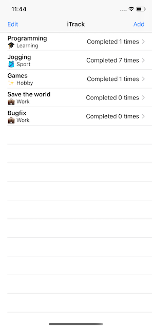
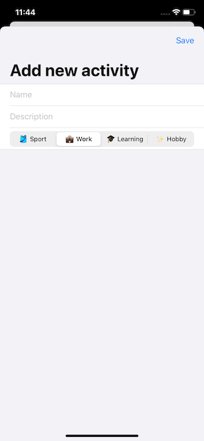

# 100 Days of Swift - Day 47 - Consolidation IV
Consolidation/Review of Days 36 to 46, notes in this readme, challenge completed in the project

 |  | 

## What I learned
- why **@State** only works with structs
- how to work with classes with **@ObservedObject** and **@Published**
- presenting and dismissing views with **sheet()** and **presentationMode**
- deleting list data with **onDelete(perform:)** or **EditButton**
- reading/writing data with **UserDefaults**, un-/archiving with **Codable** and using the **Identifiable** protocol
- using **GeometryReader**, **ScrollView** and **NavigationLink** to manage screen space
- using **Generics** in Swift
- creating **custom paths and shapes**, make them insettable and transform them using **CGAffineTransform**
- using **drawingGroup()** to enable Metal for drawing complex views
- modidying blend modes and saturation and animating with **animatableData** and **animatablePair**

## Key points
### Classes vs structs: what’s the difference and why does it matter?
The main difference between them is that classes are a reference type, while structs are a value type.
A variable that holds a struct can be thought of holding the actual data, while a variable that holds a class would hold the memory location of the data.
This is also the reason they behave differently when used as a constant, the location for a class variable remains the same, but its content can be changed, while the content of a constant struct variable can't be changed.
For SwiftUI this makes it easy to track changes in state with structs and keep data the same among different views with classes.

### Using UserDefaults wisely
UserDefaults makes it incredibly easy to store and load data since it's automatically attached to the app when it launches.
However it should only be used to store small amounts of data and it can only store certain times without encoding them first.
The supported types are strings, numbers, dates, URLs and binary data - and arrays of those types - all of them also can be stored in a plist file.
Behind the scenes UserDefaults actually uses just a property list, just like plist files.

### When to use generics
The best way to use generics is to not use them at first, acommplish what is needed and add generics and restrictions when it makes sense.

## Challenge
Create a habit-tracking app, that has ...
- a list of activities to track
- a form to add new activities
- can show a detail view with description of the activities and how often it was completed
- a way to save and load the data using Codable and UserDefaults
