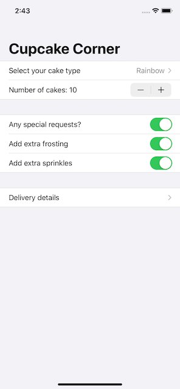
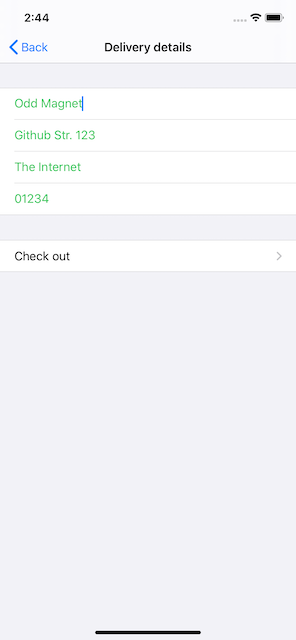

# CupcakeCorner
A multi-screen app for ordering cupcakes

  

## Adding Codable conformance for @Published properties
- for properties wrapped by @Published to conform to Codable, the class needs a custom init and encoder function
- to implement this, an enum conforming to the `CodingKey` protocol is used
- conforming simply means that every case in the enum is the name of a property that should be loaded/saved
- this enum is commonly called **CodingKeys** (with an s at the end)
- the initializer should be marked with __required__ or alternatively the class should be marked __final__
- both the `init(from:)` and `encode(to:)` functions need an argument of type **Decoder** and **Encoder** respectively
- inside them a __container__ is created from the decoder/encoder argument, e.g: `let container = try decoder.container(keyedBy: CodingKeys.self)`
- the `keyedBy:` argument ensured that the container has keys matching those in the CodingKeys enum
- after that all the properties need to be decoded (loaded, in the init) or encoded (saved, in the encode function)
- this is done via `propertyName = container.decode(Type.self, forKey: .propertyName)` and `try container.encode(propertyName, forKey: .propertyName)`

## Sending and receiving Codable data with URLSession and SwiftUI
- to receive data from a URLSession a few steps need to be taken
- first the URL from which to receive data needs to be created using `guard let url = URL(string: "the url string here")`
- next that url needs to be wrapped in an **URLRequest**: `let request = URLRequest(url: url)`
- after that the networking task needs to be created and started
- using the shared session: `URLSession.shared.dataTask(with: request) { data, response, error in ... }`
- **URLSession** manages the network request based on a the `with:` argument and runs a closure which is supplied with 3 variables
- `data` holds the data that was returned, `response` holds a description of the data (e.g. type, size, status code, etc) and `error` the error if any occured
- it's noteworthy that `data` and `error` are mutually exclusive, only one of them will be set
- **IMPORTANT** without calling `resume()` on the networking task (after the trailing closures '}') nothing will be run
- finally, the result of the networking task needs to be handled
- inside the closure the data needs to non-nil `if let data = data { ...  }`
- then the response needs to be decoded using `JSONDecoder` and the decoded data sent back to the main thread to update the UI `DispatchQueue.main.async { /* Update UI */ }`
- if the data was nil the error needs to be handled

## Validating and disabling forms
- disabling a view for user input is as simple as using a modifier on it, in this case `.disabled()`
- the modifier expects a condition to check, and if the condition is true will disable the view it's attached to
- to validate user input a computed property can be used as the condition inside the `.disabled()` modifier
- the actual validation happens in the computed property

## Sending and receiving orders over the Internet
- to send an order, first it needs to be encoded to JSON, this is trivial once the order class conforms to `Codable`
- next a URLRequest needs to be created and configured to send JSON data using a HTTP post, then the data is attached
- to test sending data without creating a web server for it, [Req | Res](https://reqres.in) will be used
- using the `setValue(value:, forHTTPHeaderField)` method the value type for the specified header field is set, e.g. `request.setValue("application/json", forHTTPHeaderField: "Content-Type")`
- with the `httpMethod` and `httpBody` properties the method is then set to "Post" and the body to the encoded data
- finally the request needs to be send and handled

## Wrap up - Challenges
- improve validation of textfields
- show an informative alert when `placeOrder()` fails
- convert the data model from class to struct
