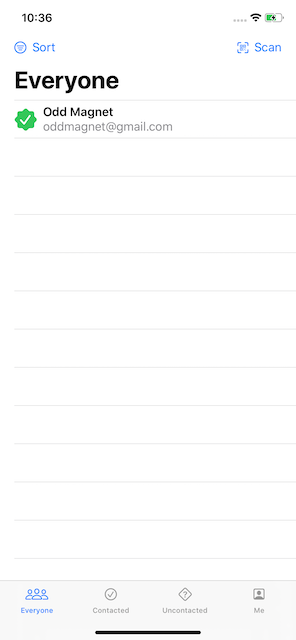

# Hot Prospects
An app to track who the users meets as conferences

  

## Reading custom values from the environment 
- when passing data through a chain of views not every view always needs to use the data
- this can be solved by using **@EnvironmentObject**
- first a class conforming to **ObservableObject** with **@Published** properties is needed
- in the parent view (e.g. __ContentView__) a instance is created and passed into the environment
- the passing is done via the `.environmentObject(variableToPass)` modifier
- every subview that declares a property of the same type will automatically have access to it `@EnvironmentObject var someVariable: itsType`
- it's important to note that the app will crash if it can't find the type of the property in the environment
- behind the scenes SwiftUI makes the connection between the passed object and `@EnvironmentObject` properties via a __dictionary__ using the type of the passed object as the key

## Creating tabs with TabView and tabItem()  
- when showing unrelated data, a **TabView** is often the way to go
- this is achieved by simply placing the desired views into a TabView
- the `.tabItem()` modifier is used on the views inside to give them an image and text to display in the tabbar on the bottom of the screen
- in SwiftUI 1.0 this is done via a closure with an Image and Text view, in 2.0 via the Label view
- it's also possible to switch between tabs programmatically:
    - pass a @State property to the `selection:` argument of the TabView
    - use the `.tag()` modifier to tag the views inside the TabView
    - set the @State property to whatever tag should be switched too

## Uunderstanding Swift's Result type
- often functions either return data or an error, usually via throwing, but this is not possible when the function doesn't return immediately
- to resolve this, Swifts **Result** type is used, it will either hold a value or an error, but never both or neither
- behind the scenes it's an Enum with associated values and two cases `.success(Data)` and `.failure(Error)`
- a custom enum that conforms to the `Error` protocol is used for the `failure(Error)` case
- to make use of the Result type, the function simply has to use it as its return value: `func someFunction() -> Result<String, SomeErrorEnum> { ... }`
- inside the function either `return .success(theData)` or `.failure(.someErrorEnumCase)` is used
- since this type is usually used for asynchronous functions, the function should have an argument for a completion closure
- `func fetchData(from urlString: String, completion: @escaping (Result<String, NetworkError>) -> Void) { ... }`
- the `@escaping` is needed for an asynchronous function to retain whatever called the function in memory, so the closure can run later on
- inside an asynchronous function, instead of returning a Result case, the completion closure is called and supplied with either `.success(theData)` or `.failure(.someErrorCase)`

## Manually publishing ObservableObject changes
- it's possible to manually publish changes in an ObserableObject
- for this, the `@Published` wrapper is removed from the property that should be manually published
- it is then changed into a computed property and inside its `willSet` `objectWillChange.send()` is called
- this allows for additional code before the change is published, e.g. for logging purposes

## Controlling image interpolation
- when Image views are stretched bigger than the source image, SwiftUI applies image interpolation by default
- usually this works well enough to not worry about, but for especially small images or pixel art the interpolation might be unwanted
- to disable the interpolation simply applying the `.interpolation(.none)` modifier is enough

## Creating context menus
- 

## Scheduling local notifications
- 

## Adding Swift package dependencies in Xcode
- 

## Later parts
- dynamically filtering a SwiftUI List

## Wrap up - Challenges
- 
