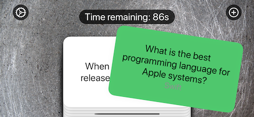
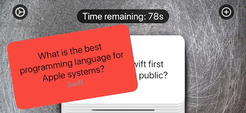
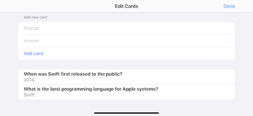

# Flashzilla
An app that helps the user learn by using flashcards

  


## How to use gestures in SwiftUI
- aside from the commonly known tap gesture, which has it's own modifier, there is a wide variety of other gestures
- `.onTapGesture(count:)` also supports a count parameter, e.g. for double & triple taps
- `.onLongPressGesture` is used for handling long presses and also supports a `minimumDuration` parameter as well as a `pressing` parameter
- `minimumDuration` takes the number of seconds, while `pressing` takes a closure that is executed before the minimumDuration is met
- for more advanced gestures the `.gesture()` modifier is used, which takes a gesture struct as it's argument
- this includes (but not limited to): `DragGesture`, `LongPressGesture`, `MagnificationGesture` and `RotationGesture`
- many of these have two special modifiers, `onChanged()` and `onEnded()` which both take a closure and provide a value (based on the gesture) to the closure
- example:

```swift
Text("Pinch me")
    .scaleEffect(finalAmount + currentAmount)
    .gesture(
        MagnificationGesture()
            .onChange { amount in
                self.currentAmount = amount -1
            }
            .onEnded { amount in
                self.finalAmount += self.currentAmount
                self.currentAmount = 0
            }
    )
```
- depending on the gesture used a different modifier before it has to be used, e.g. `.scaleEffect()` for `MagnificationGesture`, `.rotationEffect()` for `RotationGesture`, etc.
- when a view and its parent both have the same gesture modifier, one has to be given higher priority `.highPriorityGesture(/* the gesture */)`
- alternatively they could be used simultaniously by giving the parent the `.simultaneousGesture(/* the gesture */)` modifer
- finally, it's also possible to sequence gestures by calling `.sequenced()` on a gesture and passing another gesture

## Making vibrations with UINotificationFeedbackGenerator and Core Haptics
- one of the easiest ways to give haptic feedback is by simply using `UINotificationFeedbackGenerator`
- after creating an instance, simply calling `.notificationOccured()` on it is enough to get the haptic feedback
- for more advanced haptic feedback the **CoreHaptics** framework is needed `import CoreHaptics`
- to make use of it a `CHHapticEngine` is needed `@State private var hapticEngine: CHHapticEngine?`
- which should be created as soon as the view appears

```swift
guard CHHapticEngine.capabilitiesForHardware().supportsHaptics else { return  }
do {
    self.hapticsEngine = try CHHapticEngine()
    try engine?.start()
} catch {
    /* handle errors */
}
```
- to make use of the engine, parameters for intensity and sharpness are needed, an event needs to be created and passed to the pattern which is then used to create a players with said pattern
    - both intensity and sharpness are created by using `CHHapticEventParameter(parameterID:, value)`
    - the event is created via `CHHapticEvent(eventType:, parameters:, relativeTime)` 
    - where `parameters` expects an array of `CHHapticEventParameter`, most commonly the intensity and sharpness values
    - and `relativeTime` is used to create events in a sequence
    - next a pattern is created `CHHapticPattern(events:, parameters)`, where `events` expects an array of events and `parameters` an array of parameters to apply to all events
    - to create the player `makePlayer(with: )` is called on the haptics engine instance with the pattern for the player
    - finally, to use the player `start(atTime:)` is called on it
- it's possible to add multiple different events with different parameters to the array that is passed to the pattern

## Disabling user interactivity with allowsHitTesting()
- to change what a user can tap the `.allowsHitTesting()` modifier can be used
- setting it to false makes the view it is attached to unresponsive to tap events
- if there's a view behind it, that view will instead receive the tap event
- it's also possible to change the shape of the tap-able area of a view with `.contentShape()`
- which takes a `Shape` struct, such as `Rectangle()` or `Circle()`
- this is useful when a view contains spacers but the whole view should be tap-able

## Triggering events repeatedly using a timer
- since the `Combine` framework adds an extension on `Timer` that allows them to become __publishers__, it's possible to use them as such
- to create a timer publisher  `Timer`'s `.publish(every:, tolerance:, on:, in:)` method is called, followed by `.autoconnect()`
    - `every` is used to specify the interval that the timer fires on in seconds
    - `on` specifies the thread the timer should run, using an enum value
    - `tolerance` is optional and specifies the tolerance in seconds that the timer can be off, this allows iOS to optimize efficiency
    - `in` takes an enum value specifying the run loop, most commonly `.common`
- a timer publisher can then be used for example in the `.onReceive()` modifier, so that it executes some code every time the timer fires
- stopping a autoconnected timer is a bit complicated since its __upstream__ publisher needs to be connected and called `cancel()` on: `self.timer.upstream.connect().cancel()`

## Getting notified when the app moves to the background
- thanks to the **Notification Center** framework it's possible to receive all kinds of event messages
- most commonly `.onReceive()` is used to act on them
- to receive them `NotificationCenter.default.publisher(for:)` is used
- some possible arguments are (and are sent when:)
    - `UIApplication.willResignActiveNotification`, when the app goes into the background
    - `UIApplication.willEnterForeGroundNotificaion`, when the app goes into the foreground again
    - `UIApplication.userDidTakeScreenshotNotification`, when the user took a screenshot
    - `UIApplication.significantTimeChangeNotification`, when the user changes their clock or daylight savings time changes
    - `UIApplication.keyboardDidShowNotification`, when the keyboard shows

## Supporting specific accessibility needs with SwiftUI
- can be accomplished via environment properties, such as:
- `@Environment(\.accessibilityDifferentiateWithoutColor)`
    - which is either true or false and should be used to adapt the UI for color blind people
- `@Environment(\.accessibilityReduceMotion)`
    - which is either true or false and should be used to adapt the UI for less motion
    - to easily accomplish this a wrapper around `withAnimation` could be writtent
    - `func withOptionalAnimation<Result>(_ animation: Animation? = .default, _ body: () throws -> Result) rethrows -> Result { ... }`
    - inside the wrapper a simple check on `UIAccessibility.isReduceMotionEnabled` can be used to either return the body with or without `withAnimation`
- `@Environment(\.accessibilityReduceTransparency)`
    - which is either true or false and should be used to adapt the UI to use less blue and translucency and more solid backgrounds/colors

## Moving views with DragGesture and offset()
- 

## Wrap up - Challenges
- 
