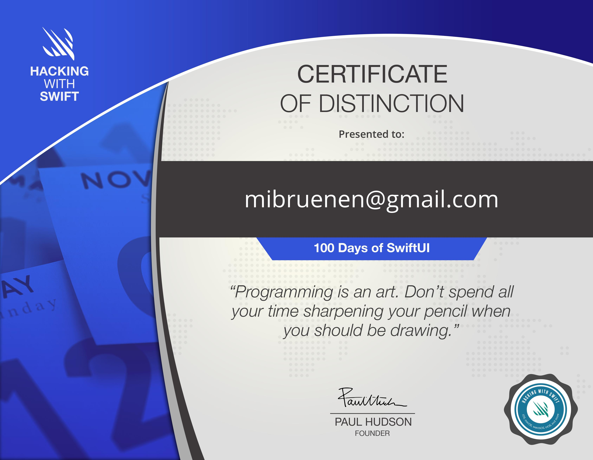

# 100 Days of Swift UI

- [Section Overview](#section-overview)
  * [Introduction](#introduction)
  * [Starting SwiftUI](#starting-swiftui)
  * [Expanding your skills](#expanding-your-skills)
  * [Scaling up to bigger apps](#scaling-up-to-bigger-apps)
  * [Focus on data](#focus-on-data)
  * [Views and View controllers](#views-and-view-controllers)
  * [Controlling UI Flow](#controlling-ui-flow)
  * [One last project](#one-last-project)
- [Day 100: Final Exam](#day-100--final-exam)

## Section Overview
### Introduction
- This section was mostly centered on learning the basics of the Swift programming language
- For the most part my experience with other programming languages translated over to Swift
- Notable exceptions were Optionals and the way Protocols and Extensions are used in Swift

### Starting SwiftUI
- While I learned a bit of iOS programming as a hobby, that was mostly centered on UIKit, so the section was the first time I really learned more about SwiftUI
- The main focus was on learning basic view types like __Stacks__, __NavigationView__, __Forms__ and how to make use of the concept that views are a function of their state
- Other important aspects were how to use __buttons__, showing __alerts__
- Lastly, in the technique project I learned more about how views and viewmodifiers work under the hood, why structs are used for most things and why 'some View' is used so much

### Expanding your skills
- After the first section I was able to easily create basic UI's and now this section focused on expanding my knowledge of all the views SwiftUI offers, in this section I learned about:
- __Stepper__, __DatePicker__ and __List__ views, got to know a bit of machine learning with __Create ML__ and learned how to work with dates in Swift
- More practice with __@State__, __Alert__ and __NavigationView__ and also learned how to load resources from the bundle
- In the technique project I learned about animations and how easy it can be to animate changes in state

### Scaling up to bigger apps
- After the last two sections I was able to create simple apps that can do simple things in a short time, now this chapter focused on the things that are needed to create bigger apps
- A new form of sharing state with __@ObservedObject__, how to show/hide views, delete items from lists, storing user settings and archiving objects
- I also got more in-depth knowledge of why __@State__ only works with structs, how to work with hierachical Codable data and how to push views on the navigation stack
- Additionally I learned about __GeometryReader__, __ScrollView__ and how to create custom __Paths__ and __Shapes__ in SwiftUI

### Focus on data
- The focus of this section, like the title says, was on data, sending and receiving it, and using __Core Data__ with SwiftUI, here I learned about:
- How to add __Codable__ conformance to __@Published__ properties, using __URLSession__ to receive and send data
- About __@FetchRequest__, how to sort and filter those requests and how to delete data, how to create custom __NSManagedObject__ subclasses, using constraints and relationships
- Additionally I practiced using more custom components, size classes and type erasure

### Views and View controllers
- After getting a grasp on how to handle data, the focus went back to views and their controllers, in this section I learned about:
- Custom bindings, __ActionSheet__, wrapping __UIViewController__ in SwiftUI views and using __coordinators__ to manage them, how to save and import images from the photo library and filter them with __Core Image__
- Adding __Comparable__ to custom types, writing to the documents directory, switching view states with enums, using __MapKit__, Touch/Face ID and extending existing types to support __ObservableObject__
- In the technique project I learned about accessibility, how to identify views, hide and group accessibility data and reading the value of controls

### Controlling UI Flow
- The more views there are, the more need for a good UI flow there is, this is what I learned in this section:
- Creating and using __TabViews__, using __@EnvironmentObject__, adding __context menus__, scheduling notifications and adding package dependencies
- Understanding how the __Result__ type works, how to manually push __ObservableObject__ changes, dynamically filtering a list, using __gestures__ and haptic feedback with __Core Haptics__
- Disabling user interactiviy, using __Timers__ getting notified when the app changes to back-/foreground and how to support specific accessibility needs
- For the technique project I learned how layout works in SwiftUI, how to use and create alignment guides and how GeometryReader works and can be used to easily create nice effects

### One last project
- For the last project the focus was on creating an app the specifically works well on iPads, for this I learned about:
- Using __NavigationView__ with two views, using __Alerts__ and __Sheets__ with optionals and using __Groups__ as transparent layout containers
- One thing that stood out to me was the last wrap up challenge of adding sorting and filtering to the list which sounded intimidating at first, but was surprisingly easy to code in a __swifty__ way

## Day 100: Final Exam

